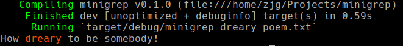

#minigrep

A basic command line text search tool based on the Unix utility `grep`.

### To run
1. If you do not have Rust installed on your machine follow these instructions for installation: https://rustup.rs/. Otherwise, skip to step 2.

2. Clone or fork this repo onto your local machine.

3. Run the program using Cargo, the package manager and build system for Rust that comes packaged with rustup. Enter this command into your terminal:
```
cargo run [SEARCH_TERM] [FILE_NAME]
```

e.g. `cargo run frog ./poem.txt`

Running the above command should produce output that looks like this:

